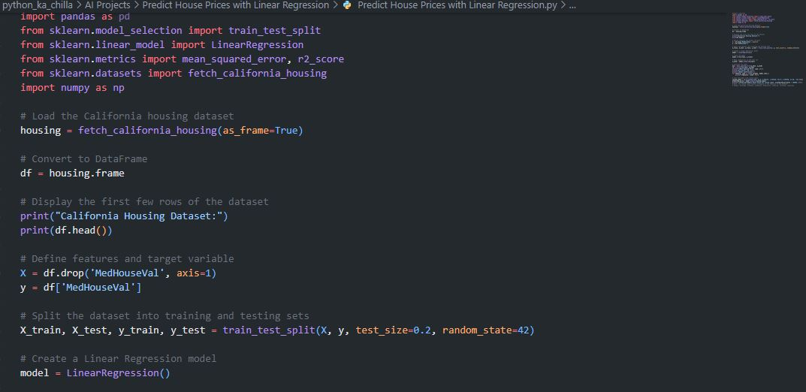
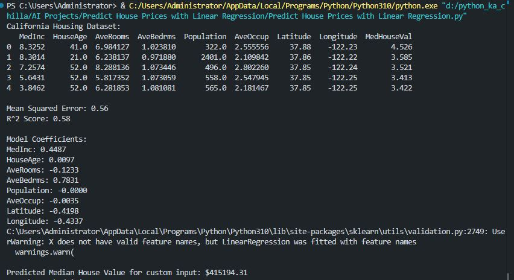

# 🏠 California House Price Prediction with Linear Regression 🤖  
     

<p align="center">
  
</p>

🚀 This project builds a **Linear Regression model** to predict median house values in California using the built‑in **California housing dataset** from scikit‑learn. It demonstrates a complete regression pipeline: data loading, exploratory analysis, train‑test split, model training, evaluation with MSE and R², coefficient interpretation, and prediction on custom input.

---

## ✨ Key Features  
📊 **California Housing Dataset** – Realistic housing data with 8 features  
🧠 **Linear Regression** – Simple yet interpretable regression algorithm  
📈 **Model Evaluation** – Mean Squared Error (MSE) and R² score  
🔍 **Coefficient Analysis** – Prints feature coefficients to show impact  
🔮 **Custom Prediction** – Predict house value for user‑provided input  

---

## 🧠 Tech Stack  
- **Language:** Python 🐍  
- **Libraries:** pandas, scikit‑learn, numpy  
- **Model:** Linear Regression  
- **Evaluation:** MSE, R² Score  

---

## 📦 Installation  


```bash
git clone https://github.com/SayabArshad/California-Housing-Price-Prediction-LinearRegression.git
cd California-Housing-Price-Prediction-LinearRegression
pip install pandas scikit-learn numpy
```
⚙️ Note: The California housing dataset is automatically downloaded by scikit‑learn when you run the script.

---

## ▶️ Usage

Run the main script:

```bash
python "Predict House Prices with Linear Regression.py"
```

The script will:

Load the California housing dataset.

Display the first few rows.

Split the data into training (80%) and testing (20%) sets.

Train a Linear Regression model.

Print MSE, R² score, and feature coefficients.

Predict the median house value for a custom input (based on the first sample).

---

## 📁 Project Structure

```
California-Housing-Price-Prediction-LinearRegression/
│-- Predict House Prices with Linear Regression.py   # Main script
│-- README.md                                          # Documentation
│-- assets/                                            # Images for README
│    ├── code.JPG
│    └── output.JPG
```
---

## 🖼️ Interface Previews

| 📝 Code Snippet | 📊 Console Output |
|:---------------:|:-----------------:|
|  |  |

---

## 💡 About the Project

Predicting house prices is a classic regression problem in machine learning. This project applies Linear Regression to the California housing dataset, which contains 20,640 samples with 8 features such as median income, house age, average rooms, and location coordinates. The model achieves an R² score of ~0.58, indicating that about 58% of the variance in house prices is explained by the features. The coefficients reveal the positive influence of median income (MedInc) and the negative impact of location coordinates (Latitude, Longitude). The script also demonstrates how to use the trained model to predict the price for a new, custom input – a crucial step toward practical deployment.

---

## 🧑‍💻 Author

**Developed by:** [Sayab Arshad Soduzai](https://github.com/SayabArshad) 👨‍💻

📅 **Version:** 1.0.0

📜 **License:** MIT License

---

## ⭐ Contributions

Contributions are welcome! Fork the repository, open issues, or submit pull requests to enhance functionality (e.g., adding polynomial features, trying other regression models, or building a web interface).
If you find this project helpful, please ⭐ star the repository to show your support.

---

## 📧 Contact

For queries, collaborations, or feedback, reach out at **[sayabarshad789@gmail.com](mailto:sayabarshad789@gmail.com)**

---

🏠 Predicting home values, one feature at a time.

---
